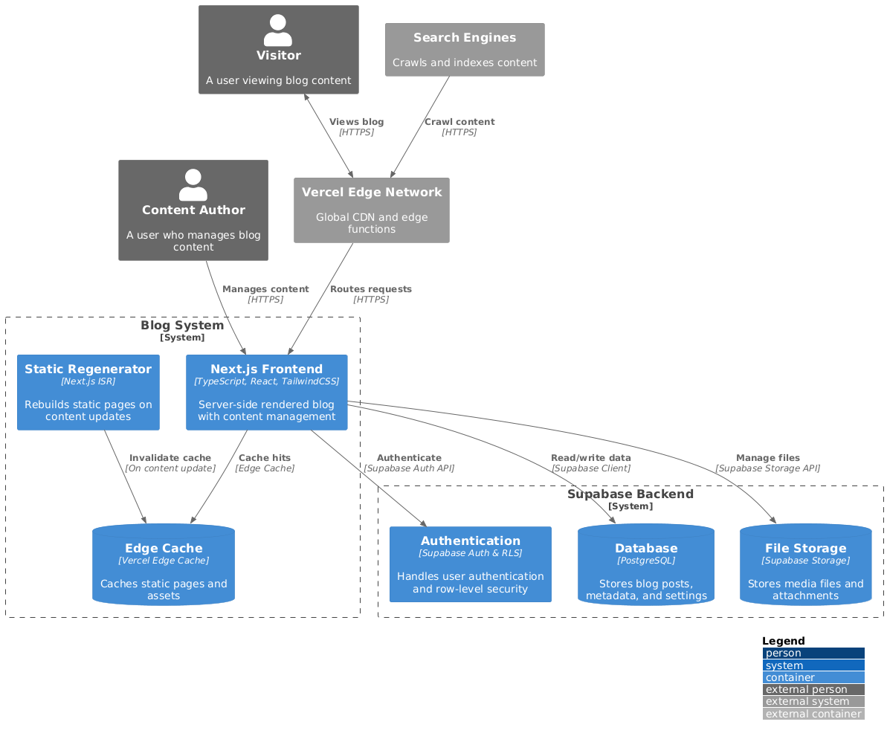

# ProPTIT Blog V2

## 1. Bối Cảnh Ra Đời

`CLB Lập Trình PTIT (ProPTIT)` từ lâu đã có nhiều thành viên tự tạo blog cá nhân với mong muốn chia sẻ kiến thức và kinh nghiệm. Trong ngành công nghệ thông tin, sự học hỏi thường bắt đầu từ những tài nguyên miễn phí trên internet. Việc chia sẻ lại những kiến thức đó không chỉ giúp cá nhân hệ thống hóa kiến thức của mình mà còn mang lại giá trị cho cộng đồng.

Tuy nhiên, những dự án blog này thường chỉ là các hoạt động tự phát, thiếu một nền tảng thống nhất và chuyên nghiệp. CLB vẫn chủ yếu đăng các bài viết kỹ thuật lên fanpage Facebook, trong khi xu hướng người dùng tìm kiếm thông tin học thuật và kỹ thuật qua Google phổ biến hơn.

`ProPTIT Blog V2` ra đời với mục tiêu xây dựng một blog thống nhất và có khả năng phát triển lâu dài, mang lại lợi ích truyền thông cho CLB và tạo ra một không gian học thuật chuyên nghiệp, nơi thành viên có thể chia sẻ kiến thức và kinh nghiệm với cộng đồng một cách dễ dàng.

## 2. Công Nghệ Sử Dụng

Để tối ưu chi phí và vẫn đáp ứng nhu cầu kỹ thuật, dự án lựa chọn các công nghệ sau:

- Hosting miễn phí: Firebase Hosting, GitHub Pages, Vercel
- Database miễn phí: Supabase (có hỗ trợ CRUD dữ liệu và phân quyền)
- Ngôn ngữ & Framework:
    - Frontend: NextJS, Mainly TailwindCSS + ShadcnUI
    - Backend: Tích hợp qua API Supabase

###  2.1NextJS được chọn vì:
- Hỗ trợ SSR (Server Side Rendering) giúp tối ưu SEO
- Sẽ vẫn làm CSR, còn để hỗ trợ SEO thì dùng function theo dạng ISR (Incremental Static Regeneration) để tạo ra các trang tĩnh giúp tối ưu SEO

## 3. Yêu Cầu Tính Năng
- Quản lý bài viết:
    - CRUD bài viết (Tạo, đọc, cập nhật, xóa)
    - Gắn tag và phân loại bài viết
- Phân quyền người dùng:
    - Quản trị viên có quyền duyệt bài, chỉnh sửa nội dung
    - Thành viên có thể đăng bài, chỉnh sửa bài viết của mình
- Tích hợp truyền thông:
    - Đồng bộ nội dung với Fanpage và YouTube của CLB
    - Cải thiện SEO để bài viết dễ được tìm kiếm trên Google
- Dễ mở rộng:
    - Giao diện và hệ thống được thiết kế để dễ nâng cấp và mở rộng tính năng
    - Chuyển giao công nghệ đơn giản, giúp các khóa sau tiếp tục duy trì

## 4. Hướng dẫn cài đặt

### 4.1 Yêu cầu

- NodeJS (>= 18.x)

### 4.2 Cài đặt

TBH

## 5. Tác Giả

TBH

## 6. Bản Quyền

TBH